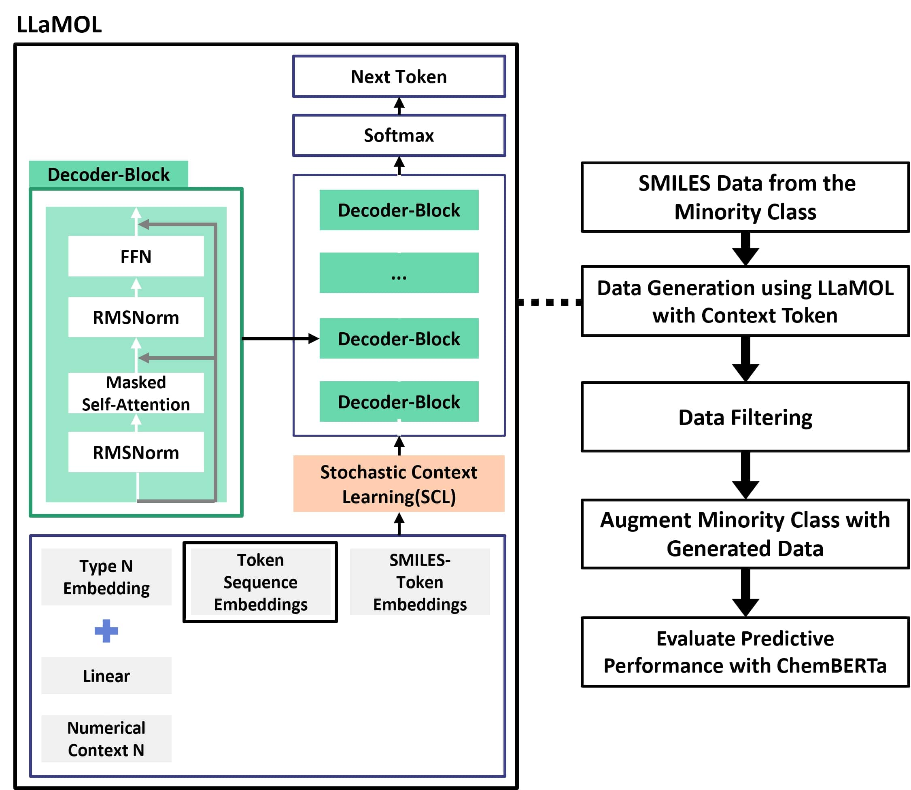

## SyntheticSMILES

### Paper title

**"Enhancing Chemical Toxicity Predictions with Synthetic SMILES from a Fine-Tuned LLM-Based Chemical Synthesis Generative Model"**

### One-Sentence summary

This study demonstrates that augmenting benchmark toxicity prediction datasets with synthetic SMILES generated by a fine-tuned LLM-based chemical synthesis model significantly improves minority class prediction accuracy and mitigates class imbalance without degrading overall performance.

  

### Abstract

The adoption of transformer-based models in toxicity prediction has significantly advanced the field, yet these models continue to struggle with data imbalances inherent in benchmark datasets such as Tox21, Clintox, HIV, and BBBP. This persistent challenge undermines their effectiveness, particularly in minority class predictions where data scarcity prevails. Recent advancements in large language models (LLMs) have demonstrated remarkable capabilities in generating synthetic Simplified Molecular Input Line Entry System (SMILES), providing a novel approach to address these imbalances. In this study, we explore the potential of LLM-generated synthetic SMILES to enhance the training datasets, focusing on the augmentation of minority classes. Our comprehensive experiments on multiple benchmark datasets show that this strategy effectively mitigates class imbalance issue but also substantially improves the minority class prediction accuracy without compromising the overall model performance. For instance, in the Tox21 dataset, we observed an increase in minority class prediction accuracy from 0.707 to 0.965. Similar improvements across other datasets further validate the efficacy of synthetic SMILES augmentation in enhancing both toxicity prediction and broader chemical property assessments.

### Environment
Create and use a virtual environment.
- LLaMOL
  - python 3.8
  - [YAML file](https://github.com/Fraunhofer-SCAI/llamol/blob/main/torch2-env.yaml)
  - [requirements.txt](https://github.com/Fraunhofer-SCAI/llamol/blob/main/requirements.txt)
- ChemBERTa
  - python 3.10
  - torch 2.6.0
  - CUDA ver. 12.2
  - refer to the 'chemical_property_prediction_with_ChemBERTa.ipynb' file to install the other packages.

### Preparation & Usage

1. Prepare original datasets(ex. TOX21, Clintox, HIV, BBBP).
- refer to the ['deepchem/molnet/load_function'](https://github.com/deepchem/deepchem/tree/master/deepchem/molnet/load_function)

2. Prepare the training data for LLaMOL.
- refer to the [[Download and preprocess the OrganiX13 dataset]](https://github.com/Fraunhofer-SCAI/llamol?tab=readme-ov-file#download-and-preprocess-the-organix13-dataset) part.
- **Note**: You must also download the 'QM9IsoFull.csv' and 'cep-processed.csv' files.
  - [QM9IsoFull.csv](https://github.com/deepchem/deepchem/blob/master/deepchem/molnet/load_function/qm9_datasets.py)
  - [cep-processed.csv](https://github.com/HIPS/neural-fingerprint/blob/master/data/2015-06-02-cep-pce/cep-processed.csv)

3. Generate synthetic SMILES by using the original SMILES as context tokens.
- refer to the 'SMILES_generation_with_LLaMOL.ipynb'.

4. Augment the original dataset by adding synthetic SMILES generated using LLaMOL.
- **Note**: The synthetic SMILES dataset must contain columns named 'SMILES' and 'label'.

5. Evaluate classification performance on the new augmented dataset using ChemBERTa.
- refer to the 'chemical_property_prediction_with_ChemBERTa.ipynb'.

### File Specifications

- **chemical_property_prediction_with_ChemBERTa.ipynb**: Code for chemical property prediction with ChemBERTa.
- **SMILES_generation_with_LLaMOL.ipynb**: Code for generating condition-token based SMILES with LLaMOL.
- **overall_model_figure.jpg**: Figure of overview of the LLaMOL-based synthetic SMILES generation and integration process.

### Acknowledgments

The authors wish to express their gratitude to Seyone Chithrananda, Gabriel Grand, and Bharath Ramsundar for their permission to utilize the ChemBERTa model, which has been instrumental in the fine-tuning processes conducted for this research. The model was accessed via Hugging Face and has significantly contributed to the outcomes discussed in this paper. This work was supported by the Hongik University New Faculty Support Program.

### License
- LLaMOL
  - [The official github repository](https://github.com/Fraunhofer-SCAI/llamol)
  - [LICENSE](https://github.com/Fraunhofer-SCAI/llamol/blob/main/LICENSE)
  -  
Licensed under <a href="http://creativecommons.org/licenses/by-nc-sa/4.0/?ref=chooser-v1" target="_blank" rel="license noopener noreferrer" style="display:inline-block;">CC BY-NC-SA 4.0</a>

- ChemBERTa
  - [The official github repository](https://github.com/seyonechithrananda/bert-loves-chemistry)
  - [LICENSE](https://github.com/seyonechithrananda/bert-loves-chemistry/blob/master/LICENSE)
  - MIT License
